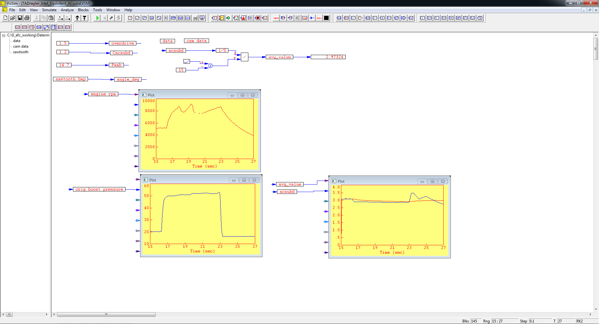
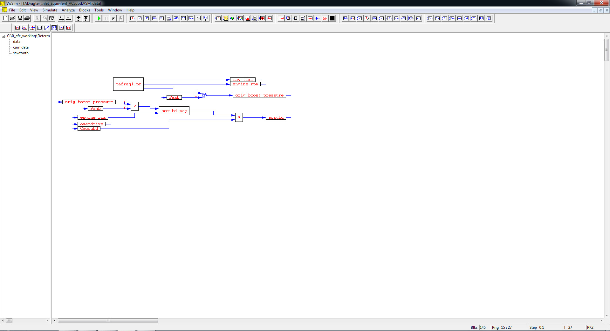
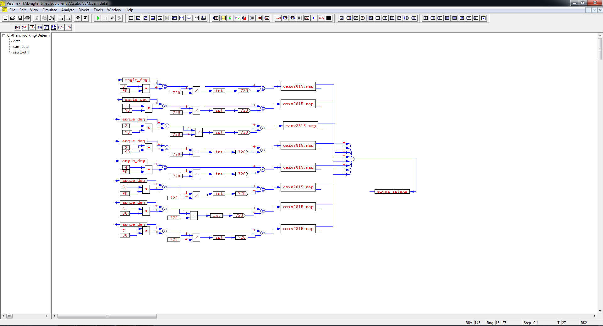

# ========================================
# Determination of NHRA Top Alcohol Dragster Equivilent Intake ACsubd using Actual Race Data and VISSIM:
# ========================================

## I. NHRA Top Alcohol Dragster Engine RPM, Intake Boost Pressure & ACsubd vs. Race Time:

## 
## 
## II. Top Alcohol Dragster Engine Data vs. Race Time Sub-System Level Diagram:

## 
## 
## III. Top Alcohol Dragster Engine Intake Cam Data vs. Race Time Sub-System Level Diagram:

## 
## *Note: Performance Data and Analysis performed using VISSIM, ( https://web.solidthinking.com/vissim-is-now-solidthinking-embed )
